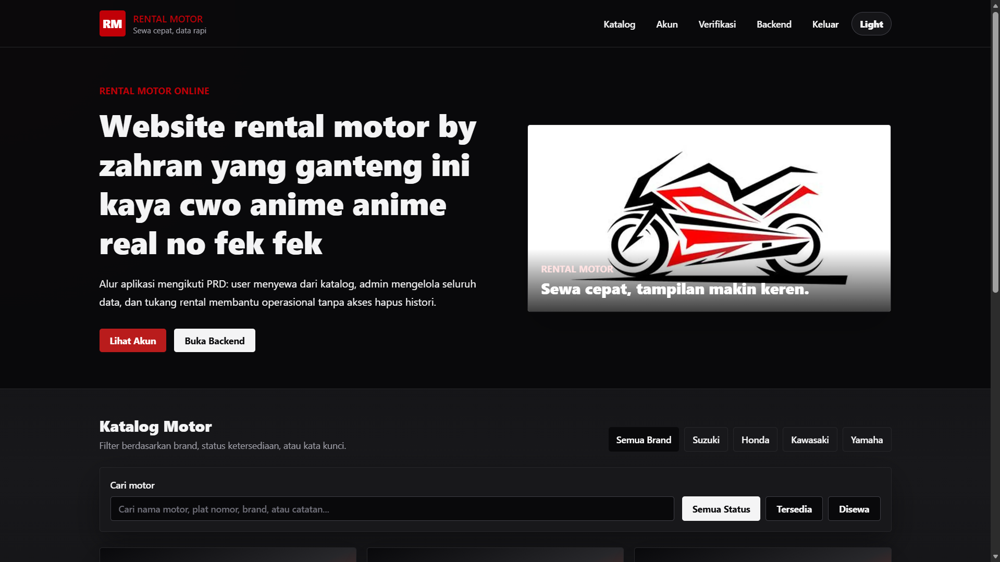
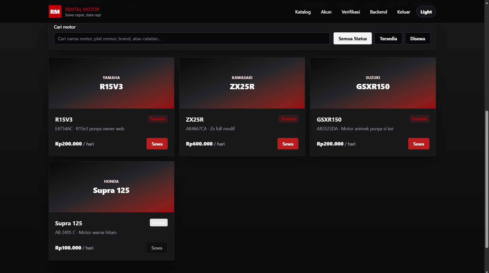

# 🏍️ Rental Motor — Sewa Cepat, Data Rapi

> **Platform Web Rental Sepeda Motor & Manajemen Armada Modern Terintegrasi**  
> Dibuat dan dikembangkan oleh **Ahmad Zahran**

---

## 📌 Pratinjau Tampilan (Preview)





---

## 📖 Gambaran Umum (Overview)

**Rental Motor** adalah aplikasi web modern berbasis **Laravel** dan **Tailwind CSS v4** yang dirancang untuk mendigitalkan proses rental kendaraan roda dua. Sistem ini mengusung moto **"Sewa Cepat, Data Rapi"**, memberikan kemudahan reservasi instan bagi pelanggan, verifikasi identitas (KYC), kalkulasi tarif otomatis, pembayaran daring via **Midtrans**, serta kontrol armada dan keuangan terpadu untuk pengelola (Admin & Operator/Tukang Rental).

---

## ✨ Fitur-Fitur Utama

### 👤 Sisi Pelanggan (Customer / Frontend)
1. **Beranda Interaktif (Home Page):**
   - Banner showcase motor 3D melayang dengan bingkai dinamis yang dapat diubah langsung dari backend.
   - Poin keunggulan layanan (*Proses Cepat*, *Aman & Terpercaya*, *Harga Bersahabat*).
   - Panduan alur 3 langkah mudah cara rental motor.
   - Tombol mengambang (*Floating Action Button*) WhatsApp dengan animasi radar pendaran untuk bantuan cepat 24/7.
2. **Katalog Motor Lengkap (Catalog):**
   - Filter multi-merek dinamis (*Yamaha, Honda, Vespa, Kawasaki, dll.*).
   - Filter status ketersediaan motor (**Semua**, **Tersedia**, **Disewa**).
   - Pencarian instan (*live search*) berdasarkan nama motor, merek, pelat nomor, atau catatan kondisi.
   - Slider foto multi-sudut (Depan, Samping, Belakang) dengan kontrol geser dan titik navigasi aktif.
   - Modal popup inspeksi unit motor beresolusi penuh.
3. **Pemesanan & Checkout Cepat (Checkout Flow):**
   - Kalender pemilih tanggal mulai dan selesai sewa.
   - Penghitungan otomatis durasi rental dan total tagihan secara *real-time*.
   - Integrasi langsung gerbang pembayaran digital **Midtrans Snap Popup**.
   - Halaman konfirmasi pembayaran otomatis (*Payment Finish*).
4. **Akun & Verifikasi Identitas (KYC Verification):**
   - Autentikasi Pengguna (Login & Register) aman berbasis token **Laravel Sanctum**.
   - Pengunggahan dokumen verifikasi keamanan penyewa (Foto KTP, KK, dan SIM).
   - Pelacakan status verifikasi akun (*Belum Terverifikasi*, *Menunggu Verifikasi*, *Terverifikasi*).
   - Riwayat penyewaan lengkap dengan status pembayaran dan status unit.
   - Fitur pengajuan pengembalian motor daring (*Submit Online Return*) langsung dari akun penyewa.
5. **Mode Tampilan Ganda (Dual-Mode Theme):**
   - Dukungan penuh mode terang (*Light Mode*) dan gelap (*Dark Mode*) dengan tombol ganti tema (*toggle*) yang tersimpan di memori peramban (*localStorage*).

---

### 🛠️ Sisi Pengelola (Admin & Tukang Rental / Backend)
1. **Dashboard Statistik Operasional:**
   - Metrik omset penjualan hari ini, jumlah rental aktif, unit tersedia, unit disewa, dan antrean verifikasi KYC.
   - Tabel ringkasan armada terbaru, transaksi sewa terakhir, dan log pembayaran masuk.
   - Formulir ganti gambar banner promosi halaman depan (*Hero Banner Uploader*).
2. **Manajemen Motor (CRUD Motor):**
   - Tambah, edit, dan hapus unit armada motor.
   - Unggah hingga 3 foto per unit motor (tampak depan, samping, dan belakang).
   - Kelola nomor polisi, harga rental per hari, catatan kelayakan motor, dan status ketersediaan.
3. **Manajemen Merek (CRUD Brand):**
   - Tambah dan kelola kategori merek motor secara dinamis.
4. **Manajemen Transaksi Daring (Online Transactions):**
   - Pantau status penyewaan pelanggan, status pembayaran Midtrans, dan konfirmasi penyelesaian sewa.
5. **Transaksi Langsung / Offline (Khusus Admin):**
   - Fitur kasir garasi untuk melayani pelanggan yang datang langsung tanpa reservasi via website.
   - Pencatatan sewa offline, pelunasan pembayaran tunai, dan pengembalian unit offline.
6. **Persetujuan Pengembalian Motor (Returns Approval):**
   - Konfirmasi pengembalian motor sewa online dan offline dengan pembaruan status unit otomatis menjadi kembali "Tersedia".
7. **Verifikasi Dokumen Pelanggan (KYC Approvals):**
   - Pratinjau berkas KTP, KK, dan SIM penyewa dengan opsi persetujuan (*Approve*) atau penolakan (*Reject*).
8. **Riwayat & Sinkronisasi Pembayaran (Payments History):**
   - Log audit pembayaran Midtrans, sinkronisasi status pembayaran, dan rekapitulasi data.

---

## 🚀 Teknologi yang Digunakan (Tech Stack)

| Komponen | Teknologi |
|---|---|
| **Framework Backend** | [Laravel 11/12](https://laravel.com/) (PHP 8.2+) |
| **Keamanan & Autentikasi** | Laravel Sanctum (Token Auth & Session Guard) |
| **Gaya & Desain Antarmuka** | [Tailwind CSS v4](https://tailwindcss.com/) (`@tailwindcss/vite`) |
| **Frontend Interaktif** | Blade Templates + Vanilla JavaScript (Fetch API, DOM Reactive State) |
| **Gerbang Pembayaran** | [Midtrans Snap](https://midtrans.com/) (Sandbox & Production Ready) |
| **Basis Data** | MySQL / MariaDB |
| **Build Tools** | Vite + Laravel Vite Plugin |
| **Font & Ikon** | Instrument Sans / Inter, SVG Icons |

---

## 📂 Struktur Direktori Penting

```text
rental-motor/
├── app/
│   ├── Http/Controllers/Api/   # Controller REST API (Auth, Motor, Rental, Return, dll.)
│   └── Models/                 # Eloquent Models (User, Motor, Brand, Rental, Payment, dll.)
├── database/
│   ├── migrations/             # Migrasi skema database
│   └── seeders/                # Data seeder bawaan (Admin, Tukang, Demo User, Armada)
├── public/
│   ├── images/                 # Aset logo, favicon, dan grafis
│   └── storage/                # Symlink penyimpanan foto motor dan dokumen KYC
├── resources/
│   ├── css/app.css             # Tema kustom Tailwind CSS v4 & komponen utilitas
│   ├── js/app.js               # Inisialisasi JavaScript & helper aplikasi
│   └── views/
│       ├── auth/               # Tampilan login & register
│       ├── backend/            # Panel manajemen admin & tukang rental
│       ├── components/layouts/ # Layout induk app.blade.php
│       ├── home.blade.php      # Halaman utama beranda
│       ├── catalog.blade.php   # Halaman katalog motor
│       ├── checkout.blade.php  # Halaman checkout & bayar sewa
│       ├── account.blade.php   # Dashboard profil penyewa & riwayat transaksi
│       └── verify.blade.php    # Formulir upload dokumen KYC
├── routes/
│   ├── web.php                 # Rute halaman antarmuka web
│   └── api.php                 # Rute RESTful API sistem
├── design.md                   # Dokumen spesifikasi Design System lengkap
└── README.md                   # Dokumentasi proyek
```

---

## ⚙️ Panduan Instalasi (Setup & Installation)

Ikuti langkah-langkah berikut untuk menjalankan proyek di komputer lokal:

### 1. Prasyarat Sistem
- **PHP** >= 8.2
- **Composer**
- **Node.js** (v18+) & **NPM**
- **MySQL** / **MariaDB** (melalui XAMPP atau instalasi mandiri)

### 2. Kloning atau Buka Direktori Proyek
```bash
cd C:\xampp\htdocs\rental-motor
```

### 3. Pasang Dependensi (Composer & NPM)
```bash
composer install
npm install
```

### 4. Konfigurasi Lingkungan (.env)
Salin file `.env.example` menjadi `.env`:
```bash
cp .env.example .env
```

Buka file `.env` dan sesuaikan pengaturan basis data serta kredensial Midtrans:
```env
APP_NAME="Rental Motor"
APP_URL=http://127.0.0.1:8000

DB_CONNECTION=mysql
DB_HOST=127.0.0.1
DB_PORT=3306
DB_DATABASE=rental_motor
DB_USERNAME=root
DB_PASSWORD=

# Kredensial Midtrans (Gunakan Sandbox Key Anda)
MIDTRANS_SERVER_KEY=SB-Mid-server-xxxxxxxxxxxx
MIDTRANS_CLIENT_KEY=SB-Mid-client-xxxxxxxxxxxx
MIDTRANS_IS_PRODUCTION=false
MIDTRANS_IS_SANDBOX=true
```

### 5. Generate Application Key & Tautkan Storage
```bash
php artisan key:generate
php artisan storage:link
```

### 6. Jalankan Migrasi & Data Seeder
Buat basis data baru bernama `rental_motor` di MySQL/phpMyAdmin, lalu jalankan:
```bash
php artisan migrate --seed
```

### 7. Jalankan Server Aplikasi
Jalankan Vite untuk kompilasi aset:
```bash
npm run dev
```

Di terminal terpisah, jalankan server pengembangan Laravel:
```bash
php artisan serve
```

Aplikasi sekarang dapat diakses melalui peramban di: **`http://127.0.0.1:8000`**

---

## 🔑 Akun Demo Bawaan (Default Credentials)

Setelah menjalankan `php artisan migrate --seed`, akun-akun berikut siap digunakan:

| Peran (Role) | Email | Kata Sandi | Hak Akses |
|---|---|---|---|
| **Admin** | `admin@rental.test` | `password` | Kelola seluruh armada, transaksi online & offline, brand, pengembalian, dan verifikasi KYC. |
| **Tukang Rental** | `tukang@rental.test` | `password` | Akses panel operasional backend, kelola armada motor, dan persetujuan pengembalian unit. |
| **Penyewa (User)** | `user@rental.test` | `password` | Akses katalog, lakukan pemesanan sewa, bayar via Midtrans, dan riwayat akun. |

---

## 📡 Ringkasan Titik Akhir API (API Endpoints)

| Metode | Endpoint | Keterangan |
|---|---|---|
| `POST` | `/api/login` | Masuk akun pengguna |
| `POST` | `/api/register` | Pendaftaran akun penyewa baru |
| `GET` | `/api/motors` | Mengambil daftar motor katalog publik |
| `POST` | `/api/rentals` | Membuat pesanan sewa motor baru |
| `POST` | `/api/midtrans/notification` | Webhook status pembayaran otomatis Midtrans |
| `POST` | `/api/verify-account` | Unggah dokumen KYC penyewa (KTP, SIM, KK) |
| `GET` | `/api/my-rentals` | Riwayat rental milik akun yang login |
| `POST` | `/api/rentals/{id}/return` | Pengajuan pengembalian motor oleh penyewa |
| `GET` | `/api/dashboard` | Data statistik operasional untuk Admin & Tukang |
| `POST` | `/api/offline-transactions` | Pencatatan rental langsung di tempat (Khusus Admin) |

---

## 🎨 Spesifikasi Desain (Design System)

Proyek ini telah dilengkapi dengan dokumen spesifikasi desain sistem formal yang terperinci di dalam file **[`design.md`](design.md)**, mencakup:
- Token warna resmi (`Racing Crimson`, `Canvas`, `Hairline`, `Semantic`)
- Aturan tipografi skala display hingga caption (*Instrument Sans*)
- Skala radius sudut (`rounded.xs` hingga `rounded.2xl` dan stadium pill `rounded.full`)
- Panduan praktik antarmuka (*Do's and Don'ts*)

---

## 👨‍💻 Pengembang (Author)

Proyek ini dibangun dan dikembangkan dengan bangga oleh:
- **Ahmad Zahran**
- *Sewa Cepat, Data Rapi.*

---

## 📄 Lisensi (License)

Proyek ini bersifat open-source dan dilisensikan di bawah [MIT License](LICENSE).
